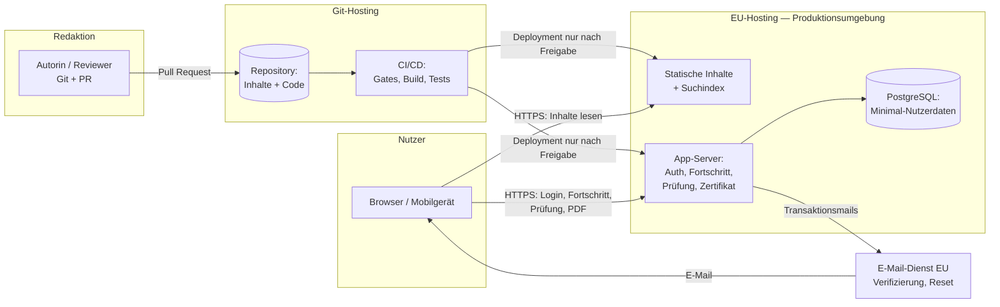

# Datenfluss-Übersicht — VersicherungsTech KI-Akademie (MVP)

**Status:** Entwurf (auf Basis der empfohlenen Architektur, Variante A)
**Stand:** 2026-07-14
**Grundlagen:** `docs/architecture-recommendation.md`,
`docs/security-and-privacy-rules.md`, `docs/product-requirements.md`
**Hinweis:** Gilt vorbehaltlich der Bestätigung von ADR-0001. Dieses
Dokument ist Grundlage für Datenschutzerklärung, Löschkonzept (L2) und
das Threat Model (`docs/threat-model-initial.md`).

---

## 1. Datenkategorien

### 1.1 Inhalte (nicht personenbezogen)

| Kategorie | Beispiele | Speicherort | Schutzbedarf |
|---|---|---|---|
| Lerninhalte | Lektionen, Quiz-, Simulations-, Ampel-Definitionen, Prompt-Vorlagen | Git-Repository → statischer Build | Integrität hoch (fachliche/regulatorische Korrektheit), Vertraulichkeit niedrig (öffentlich bzw. Premium) |
| Metadaten | Status, Version, Rechtsstand, Quellen, Rollen-Tags | Frontmatter im Repository | Integrität hoch |
| Suchindex | Indexierte veröffentlichte Inhalte | Build-Artefakt | Integrität mittel; darf nur Veröffentlichtes enthalten |

Lerninhalte enthalten per Sicherheitsregel **keine** personenbezogenen
Daten (nur synthetische Übungsdaten).

### 1.2 Nutzerdaten (personenbezogen — Minimal-Datenmodell)

| Datum | Zweck | Rechtsgrundlage (vorläufig, juristisch zu prüfen — E3) | Löschung |
|---|---|---|---|
| E-Mail-Adresse | Konto, Login, Verifizierung, Passwort-Reset | Vertrag (Kontonutzung) | Bei Kontolöschung |
| Passwort-Hash (nie Klartext) | Authentifizierung | Vertrag | Bei Kontolöschung |
| Anzeigename | Ansprache, Zertifikat | Vertrag | Bei Kontolöschung |
| Rolle, Organisationstyp (optional) | Lernpfad, Filter | Vertrag/Einwilligung durch freiwillige Angabe | Jederzeit durch Nutzer entfernbar; bei Kontolöschung |
| Einheiten-Status (offen/begonnen/abgeschlossen) | Lernfortschritt | Vertrag | Bei Kontolöschung |
| Modul-Check- und Prüfungsergebnisse | Fortschritt, Zulassung, Zertifikat | Vertrag | Bei Kontolöschung* |
| Premium-Flag + Zeitstempel | Freemium-Berechtigung | Vertrag | Bei Kontolöschung |
| Assessment-Ergebnis (Einstufung) | Lernpfad-Erzeugung | Vertrag | Bei Kontolöschung; Neuberechnung überschreibt |
| Zertifikatsdatensatz (Name, Kurs, Datum, Version, Verifikationscode) | Nachweis, Echtheitsprüfung (E7) | Vertrag | *Aufbewahrung nach Kontolöschung zu klären (L2): Verifikation vs. Löschpflicht — ENTSCHEIDUNG AUFTRAGGEBER / juristische Prüfung |
| Session-Daten (Cookie, serverseitig) | Login-Zustand | Vertrag; technisch notwendig | Ablauf/Logout |

**Ausdrücklich NICHT gespeichert:** Antwort-Detailprotokolle über das
didaktisch Nötige hinaus, Klickpfade, Verweildauern je Absatz,
personenbezogene Suchanfragen, Geräte-Fingerprints, Marketing-Profile
(FR-10.5, AC-17.6, AC-20).

### 1.3 Betriebsdaten

| Datum | Zweck | Regel |
|---|---|---|
| Server-Logs (IP, Zeitpunkt, Pfad) | Betrieb, Fehlersuche, Missbrauchsabwehr | Kurze Aufbewahrung (Vorschlag: 7–14 Tage — L2), keine Verknüpfung mit Lernprofilen |
| Backups (DB) | Wiederherstellung (NFR-F2) | Verschlüsselt, EU, Aufbewahrungsfrist im Löschkonzept (L2) |
| CI/CD-Logs | Build-Nachvollziehbarkeit | Keine personenbezogenen Daten enthalten |

## 2. Systemkomponenten und Vertrauensgrenzen

**Vertrauensgrenzen (TB):**

- **TB1** Browser ↔ Plattform (öffentliches Internet; einzige Grenze mit
  anonymen Angreifern)
- **TB2** Plattform ↔ E-Mail-Dienst (Auftragsverarbeiter, AV-Vertrag)
- **TB3** Redaktion/CI ↔ Produktionsumgebung (Deployment-Pfad;
  Freigabe-Pflicht)
- **TB4** Git-Hosting ↔ Projekt (externer Dienst für Code/Inhalte —
  enthält keine Nutzerdaten und keine Secrets)

## 3. Kernflüsse

### F1 — Inhalte lesen (Gast/Free/Premium)
1. Browser fordert Seite über HTTPS an; statische Inhalte kommen aus dem
   Build (cachebar).
2. Premium-Inhalte: App-Server prüft Session + Premium-Flag, bevor der
   Inhalt ausgeliefert wird. **Wichtig:** Premium-Volltexte sind nicht im
   öffentlich zugänglichen statischen Bundle enthalten (sonst wäre die
   Paywall nur kosmetisch — siehe Threat T5).
3. Keine personenbezogene Speicherung beim reinen Lesen ohne Login.

### F2 — Registrierung und Login
1. Registrierung: E-Mail + Passwort → Server speichert E-Mail +
   Passwort-Hash, sendet Verifizierungslink über E-Mail-Dienst (TB2).
2. Verifizierung aktiviert das Konto; Login erzeugt serverseitige Session
   (HttpOnly-, Secure-Cookie).
3. Double-Opt-in getrennt davon nur für etwaige werbliche Kommunikation
   (im MVP: keine).

### F3 — Lernen und Fortschritt
1. Abschluss einer Einheit → Browser meldet Status an App-Server →
   DB speichert (Konto-ID, Einheiten-ID, Status, Zeitstempel).
2. Lernpfad/„Weiterlernen“ wird aus diesen Statusdaten berechnet.
3. Formative Lektions-Quizze speichern nur „bearbeitet“ — keine
   Einzelantworten (FR-6.3).

### F4 — Assessment
1. Antworten werden zur Auswertung an den Server gesendet; gespeichert wird
   das **Ergebnis** (Einstufung + Teilwerte je Themenfeld), nicht der
   Antwortbogen.
2. Ergebnis erzeugt Lernpfad; Wiederholung überschreibt.

### F5 — Abschlussprüfung und Zertifikat
1. Server prüft Zulassung (alle Module abgeschlossen + Premium).
2. Prüfungsdurchlauf serverseitig bewertet; gespeichert: Versuch,
   Themenfeld-Ergebnisse, bestanden/nicht bestanden, Zeitstempel.
3. Bei Bestehen: Zertifikatsdatensatz mit Verifikationscode; PDF wird
   on-demand aus dem Datensatz erzeugt (kein PDF-Lager nötig).
4. Verifikationsseite (E7) zeigt zu einem Code nur: gültig/ungültig,
   Kurstitel, Datum — Name nur mit Zustimmung der/des Lernenden (AC-14.4).

### F6 — Premium-Freischaltung (MVP, manuell — E2a)
1. Interessent meldet sich (Formular/E-Mail) → Admin setzt Premium-Flag
   im Admin-Zugang.
2. Ausbaustufe 1: Zahlungsanbieter setzt das Flag per signiertem Webhook;
   Zahlungsdaten bleiben vollständig beim Anbieter (kein Speichern von
   Zahlungsmitteln in der Plattform).

### F7 — Redaktion und Veröffentlichung
1. Autorin ändert Inhalte per PR (TB4); CI validiert Schemata und Gates
   (Regulatorik-Review-Nachweis, keine `QUELLE ZU VERIFIZIEREN`,
   kein Video-Typ).
2. Merge nach Review; Deployment in die Produktionsumgebung **nur nach
   ausdrücklicher Freigabe** (TB3).
3. Build erzeugt statische Inhalte + Suchindex ausschließlich aus
   Status `Veröffentlicht`.

### F8 — Kontolöschung und Auskunft
1. Nutzerin löst Löschung in Selbstbedienung aus → personenbezogene Daten
   werden gemäß Löschkonzept (L2) entfernt; offene Frage: Umgang mit
   Zertifikatsdatensatz (siehe 1.2).
2. Auskunft/Export im MVP als organisatorischer Prozess (FR-16.6).

## 4. Datenschutzprinzipien im Fluss verankert

- **Ein einziger Ort für personenbezogene Daten** (PostgreSQL in EU);
  Inhalte, Suchindex, Repository und CI sind frei von Personenbezug.
- **Ergebnis- statt Verhaltensspeicherung:** Es wird gespeichert, *was
  erreicht* wurde, nicht *wie sich jemand verhalten* hat.
- **Kein Tracking ohne Rechtsgrundlage:** Im MVP keine Analytics-Skripte;
  Entscheidung M-E3 kann das später datensparsam ergänzen.
- **Auftragsverarbeiter minimal:** Im MVP genau zwei externe Dienste mit
  Datenkontakt: Hosting und E-Mail-Versand (beide EU, AV-Verträge — V3).
- **Aggregierte Metriken** (`docs/success-metrics.md`) werden aus
  Bestandsdaten berechnet, ohne zusätzliche Erhebung.

## 5. Offene Punkte für Löschkonzept und Datenschutzerklärung

| # | Punkt | Referenz |
|---|---|---|
| DF1 | Aufbewahrung des Zertifikatsdatensatzes nach Kontolöschung | L2, E7 — bleibt reviewpflichtig (Vorgabe Auftraggeber 2026-07-15); Datenmodell muss Löschung, Anonymisierung, Deaktivierung und Zertifikats-Widerruf unterstützen |
| DF2 | Log-Aufbewahrung | **Vorläufig 2026-07-15:** Sicherheitslogs ≤ 14 Tage (länger nur bei dokumentiertem Vorfall); keine Prompts/Freitexte/Zugangsdaten in Anwendungslogs — juristisch zu prüfen |
| DF3 | Backup-Aufbewahrung | **Vorläufig 2026-07-15:** ≤ 30 Tage — juristisch zu prüfen |
| DF4 | Konkrete Hosting- und E-Mail-Anbieter inkl. AV-Verträge | T5, V3, F4 — Vergleich in `docs/hosting-comparison.md`, Entscheidung ADR-0002 |
| DF5 | Inaktive Konten | **Vorläufig 2026-07-15:** Löschprüfung nach 24 Monaten — juristisch zu prüfen |
